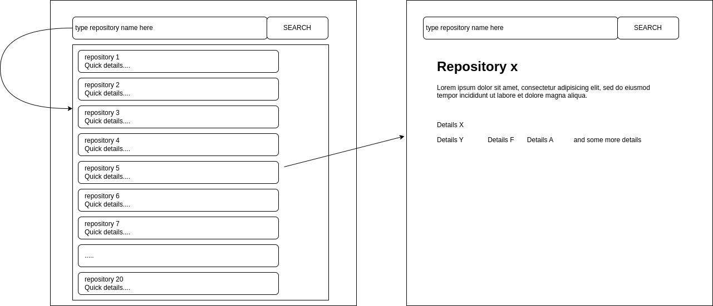

# Babuspace 

## Full-Stack Intern Position Assessment

### Description
For this assessment, you must build a web application that interacts with the [GitHub ReST API](https://docs.github.com/en/rest). We kept the requirements as light as possible and provided a short description to allow you to be as creative as possible.

The backend for this web application must collect data exposed by the GitHub ReST API and displays it. The front-end must be built using:
- HTML
- JavaScript
- CSS
- Any backend stack of your choice

**GitHub** is the leading hosting platform for Git repositories. **Git** is the leading version control system in the world. You should familiarise yourself with these two technologies before trying this task. Please take the time to understand how they work before implementing your solution.

Using CSS frameworks such as Bootstrap or Tailwind is recommended.

### Getting Started
Please clone this repository on your local machine to get started.

### Requirements
For this task, we will limit ourselves to listing and searching through the list of repositories under your account.

The UI you will build must provide a way to:
- list the last five repositories. 
- Search among all your repositories by _name_ or by _description_. This includes repositories that are private, public, forked, etc. 
- display detailed information about a selected repository and the repositories' last ten commits and their hash, message, date, and owner.

> _Important_: **The UI must be responsive**

A simple interface would be like this:

### Submitting your solution
To submit your solution, please make sure you follow the instructions below:
- Create a **private** repository on GitHub and upload your code to it. *Any solution submitted through a public repository will not be reviewed*.
- Send an invitation to collaborate to alfred.nehemie@gmail.com, yannickmakwenge@gmail.com, and shongwe1408@gmail.com. This will let us know that you are done and that your work is ready for review. Failure to do so will result in a delayed review should you choose to let us know using a different channel.
- Please ensure you have provided all information needed to run your project locally, such as a sample environment file.

### The DONTs
- Please do not cache data on the client in your solution. It is okay to hit the GitHub endpoint to list and search repositories.
- Do not submit your solution in a public repository.
- Do not use UI Frameworks such as React.js or Vue.js, etc. Keep it simple!

### Bonus point
- Implement caching on the Back-end where necessary.
- Unit Testing

Good luck!
