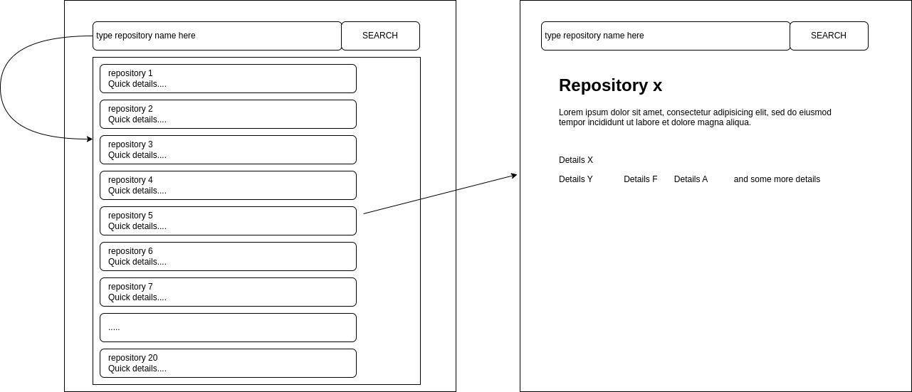

# Babuspace 

## Front-End Intern Position Assessment

### Description
For this assessment, you are required to build a simple client interface that interacts with the [GitHub ReST API](https://docs.github.com/en/rest). We tried to keep the requirements as light as possible and provide a short description to allow you to be as creative as possible.

You must build a user interface that, behind the scene, collects data exposed by the GitHub ReST API, and displays it. You are required to build this interface using:
- HTML
- JavaScript
- CSS

GitHub is the leading hosting platform for Git repositories. Git is the leading version control system. You may need to familiarize yourself with these two technologies before attempting to complete this task. Please take the time to understand how they work before implementing your solution. You will also need to review some JavaScript concepts such as:
- DOM Manipulation
- Fetch API
- Arrays
- Promise
- etc.

Using CSS frameworks such as Bootstrap or Tailwind is advised.

### Getting Started
Please clone this repository on yur local machine to get started. More details at https://docs.github.com/en/repositories/creating-and-managing-repositories/cloning-a-repository

### Requirements
You can create a personal account or an organization account on GitHub to host your code. You can then create multiple repositories under that account. The GitHub ReST API allows you to get information on GitHub accounts including GitHub repositories. It also allows you a wider range of possibilities. For this task, we will limit ourselves to getting listing and seraching through the [GitHub](https://github.com/github) organisation which has more than [450 publicly available repositories](https://github.com/orgs/github/repositories)

The UI you will build must provide a way to:
- list the last 20 repositories. 
- search among all 450+ repositories by name or by description.
- display detailed information on a repository among those listed.

A sinple interface would like this:

For this assessment using the `repos` should be enough. But you may make use of other endpoints to build a more robust solution. For more details on the `repos` endpoint works please visit https://docs.github.com/en/rest/repos/repos?apiVersion=2022-11-28#list-organization-repositories

### Submitting your solution
To submit your solution, please make sure you follow the instructions below:
- Create a private repository on GitHub and upload your code to it. *Any solution submitted through a public repository will not be reviewed*.
- Send an invitation to collaborate to alfred.nehemie@gmail.com. This will inform us that you are done and that your work is ready for review. Failure to do so will result in delayed review, should you choose to let us know using a different channel.

### The DONTs
- Please do not cache data on the client in your solution. It is okay to hit the GitHub endpoint to list and search repositories.
- Do not submit your solution in a public repository.
- Do not use UI Framework such as React or Vue.js
